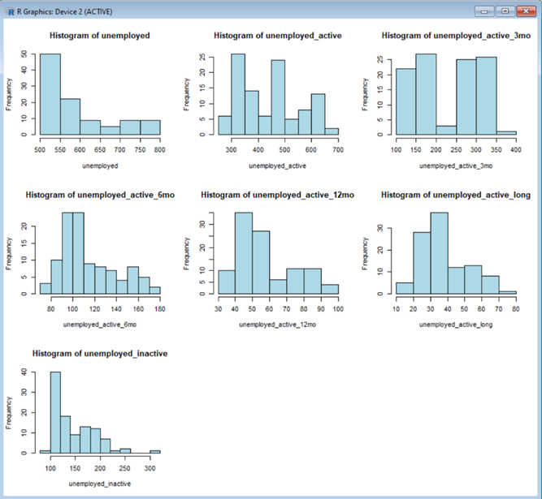

# Rising Unemployment Rates in Malaysia: Statistical Analysis (2016-2024)

[](https://www.r-project.org/)
[](https://opensource.org/licenses/MIT)

## 📋 Project Overview

This project presents a comprehensive statistical analysis of unemployment trends in Malaysia from January 2016 to August 2024. The study examines the rising unemployment rates, focusing on the monthly breakdown of active and inactive unemployment categories, as well as unemployment duration ranging from short-term (less than 3 months) to long-term (12+ months).

---

## 🎯 Objectives

1. **Analyze trends** in Malaysia's unemployment rates from 2016 to present
2. **Investigate** the distribution of unemployment duration across different time brackets
3. **Identify** main factors contributing to the increase in unemployment
4. **Explore differences** in active and inactive job-search behavior among the unemployed
5. **Provide insights** and recommendations for policy interventions

## 📁 Repository Structure

```
malaysia-unemployment-analysis/
├── README.md
├── LICENSE
├── malaysia_unemployment_analysis_2016_2024.R
└── images/
    ├── Unemployment Trend.png
    ├── Boxplot with outlier.png
    ├── Boxplot without outlier.png
    ├── correlation matrix.png
    ├── Histograms.png
    ├── Regression Analysis.png
    └── Unemployment Trend Overtime.png
```

## 📊 Dataset Description

**Source**: [Department of Statistics Malaysia (DOSM) - Labour Force Survey](https://open.dosm.gov.my/data-catalogue/lfs_month_duration)

**Period**: January 2016 - August 2024 (104 monthly observations)

**Variables**:
- `date`: Monthly date (YYYY-MM-DD format)
- `unemployed`: Total number of unemployed individuals (in thousands)
- `unemployed_active`: Actively seeking employment (in thousands)
- `unemployed_inactive`: Not actively seeking employment (in thousands)
- `unemployed_active_3mo`: Actively unemployed for less than 3 months (in thousands)
- `unemployed_active_6mo`: Actively unemployed for 3-6 months (in thousands)
- `unemployed_active_12mo`: Actively unemployed for 6-12 months (in thousands)
- `unemployed_active_long`: Actively unemployed for more than 12 months (in thousands)

## 🔍 Analysis Performed

### 1. Data Preprocessing
- ✅ Missing value detection and handling
- ✅ Data type conversion (date formatting)
- ✅ Outlier identification and treatment using boxplots
- ✅ Data validation and cleaning

### 2. Exploratory Data Analysis (EDA)
- **Summary Statistics**: Comprehensive descriptive statistics for all variables
- **Distribution Analysis**: Histograms for each numeric variable
- **Temporal Trends**: Time series visualization of unemployment over time
- **Correlation Analysis**: Heatmap showing relationships between variables

### 3. Statistical Modeling
- **Time Series Analysis**: Visualization of total vs. active unemployment trends
- **Linear Regression**: Model predicting active unemployment from total unemployment
  - R² = 0.8702 (87.02% variance explained)
  - Adjusted R² = 0.8689
  - F-statistic = 683.8 (p < 2.2×10⁻¹⁶)
  - Strong positive correlation (coefficient = 1.1533)

### 4. Model Diagnostics
- Residual analysis
- Confidence interval estimation
- Model fit evaluation

## 🔧 Requirements

### Required R Packages
```r
install.packages(c(
  "ggplot2",      # Data visualization
  "ggcorrplot"    # Correlation heatmap visualization
))
```

## 🚀 Usage Instructions

### 1. Clone the Repository
```bash
git clone https://github.com/yourusername/malaysia-unemployment-analysis.git
cd malaysia-unemployment-analysis
```

### 2. Download the Dataset
Download the dataset from [DOSM Data Catalogue](https://open.dosm.gov.my/data-catalogue/lfs_month_duration) and save it as `lfs_month_duration.csv` in the project directory.

### 3. Update File Path
Open `malaysia_unemployment_analysis_2016_2024.R` and update line 2 with your local path:
```r
unemployment_data <- read.csv("path/to/your/lfs_month_duration.csv")
```

### 4. Run the Analysis
```r
source("malaysia_unemployment_analysis_2016_2024.R")
```

## 📸 Visualizations

### Data Distribution Analysis
<p align="center">
  
</p>

*Figure 2: Histogram distribution of all unemployment variables showing frequency patterns across different categories*

---

### Outlier Detection - Before Treatment
<p align="center">
  
</p>

*Figure 3: Boxplot analysis before outlier treatment showing anomalies in the unemployment data*

---

### Outlier Detection - After Treatment
<p align="center">
  
</p>

*Figure 4: Boxplot analysis after outlier treatment demonstrating cleaner data distribution*

---

### Unemployment Trend Analysis
<p align="center">
  
</p>

*Figure 5: Overall unemployment trend from 2016 to 2024*

---

### Temporal Unemployment Trends
<p align="center">
  
</p>

*Figure 6: Detailed time series analysis comparing total unemployment vs active unemployment over time*

---

### Correlation Analysis
<p align="center">
  
</p>

*Figure 7: Correlation heatmap showing strong positive relationship (r = 0.93) between total and active unemployment*

---

### Regression Analysis
<p align="center">
  
</p>

*Figure 8: Linear regression model with 95% confidence interval (R² = 0.8702, p < 2.2×10⁻¹⁶)*

**Key Statistical Findings:**
- **Strong positive correlation**: For every 1,000 increase in total unemployment, active unemployment increases by ~1,153
- **Model explains 87%** of variance in active unemployment
- **Highly significant relationship** (F-statistic = 683.8)
- Confidence intervals demonstrate robust model predictions

## 📈 Key Findings

### 1. COVID-19 Impact
- **Sharp spike** in unemployment during early 2020
- Peak unemployment exceeded 700,000 individuals
- Demonstrated dramatic economic fallout from the pandemic

### 2. Recovery Phase (2021-2024)
- **Gradual decrease** in unemployment post-2020
- Divergence between total and active unemployment trends
- Stabilization at levels still higher than pre-pandemic

### 3. Statistical Relationships
- **Strong positive correlation** (0.93) between total and active unemployment
- For every 1,000 increase in total unemployed, active unemployed increases by ~1,153
- Model explains 87% of variance in active unemployment

### 4. Distribution Patterns
- Most unemployment cases are **short-term** (less than 3 months)
- Right-skewed distribution for inactive unemployment
- Moderate variability across most unemployment duration categories

## 💡 Recommendations

### For Policymakers
1. **Targeted Interventions**: Develop specific programs for different unemployment duration groups
2. **Skill Development**: Address skill mismatches through training and upskilling programs
3. **Economic Resilience**: Strengthen labor market flexibility to handle future shocks
4. **Support Systems**: Enhance unemployment benefits and job search assistance

### For Future Research
1. **Regional Analysis**: Examine unemployment patterns across different states and regions
2. **Demographic Breakdown**: Analyze age, gender, and education-specific unemployment
3. **Sectoral Analysis**: Investigate unemployment by industry and sector
4. **Predictive Modeling**: Develop forecasting models using machine learning techniques
5. **Policy Impact**: Evaluate effectiveness of existing unemployment intervention programs

## 🔬 Methodology

### Statistical Tests
- **Linear Regression**: Ordinary Least Squares (OLS)
- **Correlation Analysis**: Pearson correlation coefficient
- **Residual Diagnostics**: Normality and homoscedasticity checks

### Visualization Techniques
- Time series plots
- Scatter plots with regression lines
- Histograms and boxplots
- Correlation heatmaps

## 📚 References

1. **Blanchard, O., & Diamond, P. (1989)**. The Beveridge curve. *Brookings Papers on Economic Activity*, 1(1), 1–76.

2. **Coibion, O., Gorodnichenko, Y., & Weber, M. (2020)**. Labor markets during the COVID-19 crisis. *NBER Working Paper No. 27159*.

3. **Freedline Baba, J., & Abang Ali, D. H. B. (2021)**. Economic Determinants of Unemployment in Malaysia: Short and Long Run Causality. *Journal of Public Administration and Governance*, 11(1), 251.

4. **Jamaludin, S., Said, R., Ismail, N. W., & Nor, N. M. (2021)**. Are Jobs Available in the Market? A Perspective from the Supply Side. *Sustainability*, 13(4), 1973.

5. **Choo, C. (1982)**. Accelerated industrialization and employment opportunities in Malaysia. *Geoforum*, 13, 11-18.

## 📝 License

This project is licensed under the MIT License - see the [LICENSE](LICENSE) file for details.

## 🙏 Acknowledgments

- **Department of Statistics Malaysia (DOSM)** for providing open access to labour force data

## 📊 Data Availability

The dataset used in this analysis is publicly available at:
[https://open.dosm.gov.my/data-catalogue/lfs_month_duration](https://open.dosm.gov.my/data-catalogue/lfs_month_duration)

---

**Last Updated**: December 2024  
